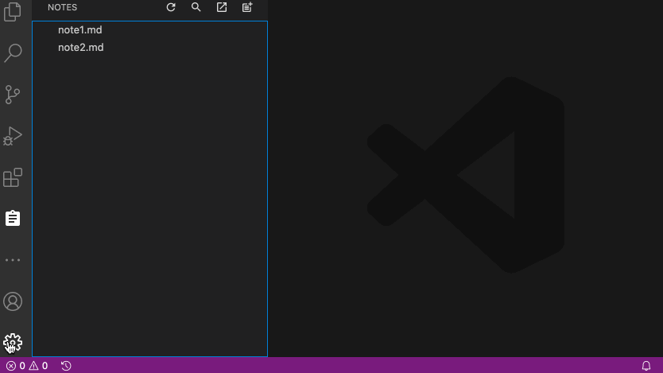

# shared-notes README

This is VS Code extension, which help you to work with shared list of files. Those files can be used for notes in plain text, `markdown` or other format. 

> Tip: To use it more efficient, I recommend place this folder inside or your `Yandex.Disk`, `OneDrive` or `GoogleDrive` folder, it help you to persist and share those notice between different devices.

> Alternative solutions ([Notes](https://github.com/dionmunk/vscode-notes/),[next-note](https://git.thisco.de/vbatts/vscode-next-note))

## Features

- `alt+n`/`option+N` shortcut - creates new note
- `alt+l`/`option+l` shortcut - search text in notes

## Extension Settings

This extension contributes the following settings:

* `SharedNotes.rootFolder`: set local directory, which contains all your notes

